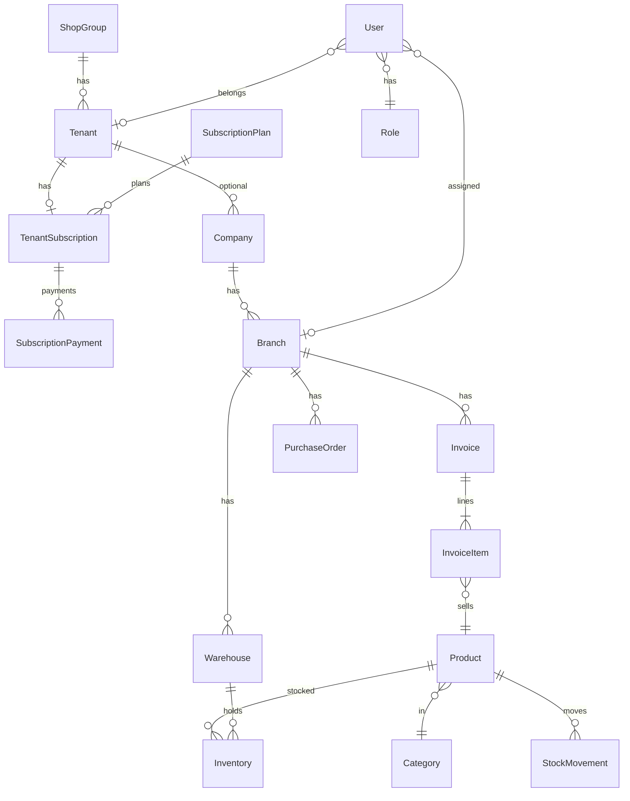
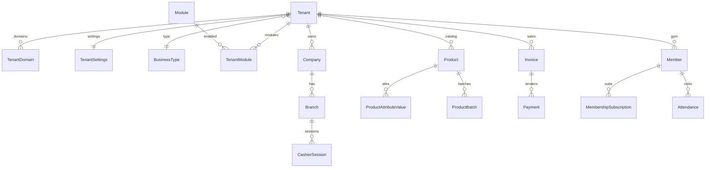

# Database ERD — Current & Target

**Date:** 2026-08-07  
**Source of truth for transform planning.**  
Supersedes outdated tenant-less diagrams in `docs/architecture/DATABASE_ERD.md` for SaaS planning (that file remains historical desktop-ERP context).

---

## 1. Legend

```
[PK]  Primary key (UUID unless noted)
[FK]  Foreign key
[UQ]  Unique
[$$]  Decimal money / quantity
[~]   Soft-delete BaseModel fields implied (created_at, updated_at, deleted_at, …)
```

---

## 2. Current ERD (as implemented)

### 2.1 Platform & IAM

```
ShopGroup[~]
  id[PK], name, slug[UQ], contacts, is_active
    │
    │ 1:N
    ▼
Tenant[~]
  id[PK], name, slug[UQ], country, timezone, is_active, sync_secret
  shop_group_id[FK]
    │
    │ 1:1
    ▼
TenantSubscription[~]
  reference_code[UQ], status, dates, fees, grace/warning
  plan_id[FK] ──► SubscriptionPlan[~] (code[UQ], monthly_price[$$], max_users, max_branches)
    │
    │ 1:N
    ▼
SubscriptionPayment[~]
  payment_reference[UQ], amount[$$], Waafi fields, status, period_key

User[~] (AbstractUser + UUID)
  role_id[FK] ──► Role[~] ──► RolePermission ──► Permission (codename[UQ])
  branch_id[FK]?
  tenant_id[FK]?
  managed_shop_group_id[FK]?
  is_platform_admin
  (+ UserPermission M2M-like)

StaffEvaluation[~] — staff, evaluator, branch, period, rating

AuditLog — user, action, module, entity, old/new JSON, IP, UA (no tenant_id)
```

### 2.2 Organization settings

```
Company[~]
  tenant_id[FK]? → Tenant
  name, legal_name, tax_id, contacts, logo
    │
    │ 1:N
    ▼
Branch[~]
  company_id[FK], name, code, UQ(company, code), is_default
    │
Setting[~] — key, value JSON, optional company/branch, UQ(key, branch, company)
```

### 2.3 Catalog (not tenant-scoped today)

```
Category[~] ──parent──► Category
Brand[~] name[UQ]
Unit[~]
Product[~]
  sku[UQ], barcode[UQ]?, name
  category_id[FK], brand_id[FK]?, unit_id[FK]
  cost_price[$$], selling_price[$$], minimum_stock, image, is_active
```

### 2.4 Inventory

```
Warehouse[~]
  branch_id[FK], code, UQ(branch, code), is_default
    │
Inventory[~]
  product_id[FK], warehouse_id[FK], UQ(product, warehouse)
  quantity[$$], reserved_quantity[$$], damaged_quantity[$$], returned_quantity[$$]

StockMovement[~]
  product, warehouse, movement_type, quantity[$$], reference_type/id

InventoryTransaction[~]
  inventory_id[FK], transaction_type, qty before/after/change[$$], reference

InventoryAdjustment[~]
  adjustment_number[UQ], warehouse, branch, reason, status
    │
InventoryAdjustmentItem[~] — product, qty before/after/change[$$]
```

### 2.5 Parties

```
Customer[~]
  customer_code[UQ], type, credit_limit[$$], outstanding_balance[$$]
  branch_id[FK]?   ← optional only; no tenant

Supplier[~]
  supplier_code[UQ], payment_terms, outstanding_balance[$$]
  ← no branch/tenant
```

### 2.6 Sales / POS documents

```
Quotation[~] — branch, customer, number UQ(branch, quotation_number), money[$$]
  └── QuotationItem[~] — product, qty, unit_price, line_total[$$]

Invoice[~] — branch, customer, quotation?, created_by, served_by
  number UQ(branch, invoice_number)
  status includes on_hold; amount_paid[$$]; notes ← payment method encoded here
  └── InvoiceItem[~] — product, qty, unit_price, line_total[$$]

DocumentSequence[~] — branch, kind, last_value, UQ(branch, kind)

Expense[~] — branch, date, category, amount[$$]   (in sales app)
```

**No Payment / CashierSession tables today.**

### 2.7 Purchases

```
PurchaseOrder[~] — supplier, branch, ordered_by, status, totals[$$]
  UQ(branch, order_number)
  └── PurchaseOrderItem[~] — product, qty_ordered, qty_received, unit_cost[$$], line_total[$$]
```

Receiving does not yet create inventory movements.

### 2.8 Futsal

```
Court[~] — branch, code UQ(branch,code), hourly_rate[$$]
Team[~] — branch
Player[~] — team, branch
CourtBooking[~] — court, branch, team?, customer?, hours, amounts[$$]
FutsalLedgerEntry[~] — branch, booking?, amount[$$], income/expense
```

### 2.9 Sync

```
ShopSyncSnapshot
  tenant_id[FK], device_id, synced_at, kpis JSON, invoices JSON, payload JSON
```

### 2.10 Current relationship diagram (compact)



---

## 3. Target ERD (shared-schema Stage A)

Additive; existing tables gain `tenant_id` where marked.

### 3.1 Control plane (`public` conceptually)

```
Tenant (extend)
  + business_type_id[FK]
  + currency, language, status
  + trial_ends_at, branding fields…

TenantDomain[~]
  tenant_id[FK], domain[UQ], is_primary, is_custom, verified_at

TenantSettings[~]
  tenant_id[FK] 1:1, JSON/settings columns

BusinessType[~]
  code[UQ], name, default_modules JSON / M2M

Module[~]
  code[UQ], name, category

TenantModule[~]
  tenant_id[FK], module_id[FK], enabled, UQ(tenant, module)

SubscriptionPlan (extend)
  + features M2M / SubscriptionFeature
  + module entitlements, storage limits, api_access, custom_domain flags

FeatureFlag (optional)
  key, scope global|tenant|plan
```

### 3.2 Tenant-owned core (add tenant_id)

```
Company, Branch, Warehouse
Category, Brand?, Unit?, Product  → UQ(tenant, sku), UQ(tenant, barcode)
Customer → UQ(tenant, customer_code)
Supplier → UQ(tenant, supplier_code)
Inventory, StockMovement, InventoryTransaction, Adjustments
Quotation, Invoice, DocumentSequence, Expense
PurchaseOrder (+ future GoodsReceipt)
AuditLog → + tenant_id, branch_id
```

### 3.3 Payments & cash (new)

```
Payment[~]
  tenant_id, branch_id, invoice_id?
  method, amount[$$], reference, status, paid_at
  cashier_session_id?

CashierSession[~]
  tenant_id, branch_id, user_id
  opened_at, opening_float[$$], closed_at, closing_count[$$], status
```

Backfill Payment rows from parseable `Invoice.notes` where possible; keep notes during transition.

### 3.4 Attribute engine (new)

```
AttributeDefinition[~] — tenant or system scope, data_type, flags
AttributeOption[~]
ProductAttributeValue[~] — product, definition, value_* columns / JSON
BusinessTypeAttribute / CategoryAttribute — assignment
```

### 3.5 Inventory advanced (new / extend)

```
StockLocation (optional)
StockTransfer / StockTransferLine
GoodsReceipt / GoodsReceiptLine → creates StockMovement(purchase)
ProductBatch / Lot
  product, batch_number, mfg/expiry, qty, costs
  UQ(tenant, product, batch_number)
SerialNumber (electronics)
```

### 3.6 Pharmacy (new)

```
Medicine profile via attributes + ProductBatch
PharmacyAlert thresholds in TenantSettings
POS line → batch allocation (FEFO)
```

### 3.7 Gym (new)

```
Member[~] — optional customer_id[FK], membership_number UQ(tenant, number), status
MembershipPlan[~]
MembershipSubscription[~] — member, plan, dates, status, visits, freeze
Attendance[~] — member, branch, check-in/out, source (qr|barcode|manual|…)
Trainer, TrainerSpecialty, TrainerSchedule
MemberTrainerAssignment, PersonalTrainingSession
GymClass, ClassSchedule, ClassBooking
Exercise, WorkoutPlan, WorkoutDay, WorkoutExercise
MemberWorkoutAssignment, WorkoutProgress, BodyMeasurement
```

Gym sales reuse Payment / Invoice.

### 3.8 Finance (new)

```
Account (chart of accounts)
JournalEntry / JournalLine
BankAccount / CashAccount
(Link Payment → journal in later iteration)
```

### 3.9 Target compact diagram



---

## 4. Index strategy (target)

Priority composites after `tenant_id` exists:

| Table | Indexes |
|-------|---------|
| products | `(tenant_id, sku)`, `(tenant_id, barcode)`, `(tenant_id, name)` |
| invoices | `(tenant_id, branch_id, created_at)`, `(tenant_id, status)` |
| inventory | `(warehouse_id, product_id)` existing; add tenant via join or denoise |
| stock_movements | `(tenant_id, created_at)`, `(product_id, created_at)` |
| product_batches | `(tenant_id, expiry_date)`, `(product_id, expiry_date)` |
| members | `(tenant_id, membership_number)`, `(tenant_id, status)` |
| attendance | `(tenant_id, member_id, check_in_at)` |
| customers | `(tenant_id, customer_code)`, `(tenant_id, phone)` |

Avoid duplicate overlapping indexes; measure with `EXPLAIN` on hot POS search.

---

## 5. Transaction-sensitive tables

Treat with `transaction.atomic()` + row locks as needed:

- `inventory`, `stock_movements`, `inventory_transactions`
- `invoices`, `invoice_items`, `payments`
- `document_sequences`
- `purchase` receiving / transfers
- `membership_subscriptions`, `class_bookings` (capacity)
- `cashier_sessions` close
- `tenant_subscriptions` / `subscription_payments`

---

## 6. Migration notes for ERD changes

1. Never drop `Invoice.notes` until Payment backfill verified  
2. Keep futsal tables branch-scoped; add `tenant_id` for consistency  
3. `Brand.name` global unique → decide shared vs per-tenant brands  
4. Schema-per-tenant would relocate tenant-owned tables out of `public`; control plane stays

---

*See [MIGRATION_STRATEGY.md](./MIGRATION_STRATEGY.md) for backfill/rollback procedures.*
