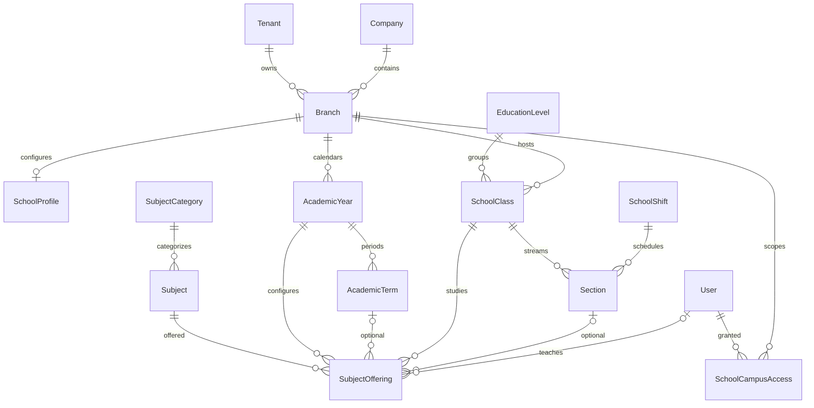

## Phase 2 implemented schema — 2026-09-12

See [Phase 2 report](SCHOOL_PHASE_2_IMPLEMENTATION.md) for migrations and deployment restrictions.



Created: EducationLevel, SchoolClass, Section, SchoolShift, SubjectCategory, Subject, SubjectOffering, SchoolCampusAccess. Extended: SchoolProfile, AcademicYear, AcademicTerm; shared Branch gains conditional tenant/code uniqueness. Existing UUIDs/rows remain intact.

New master tables require tenant. Existing School tables use non-null tenant check constraints after backfill/preflight. Year/term dates are strictly ordered. Current years must be active and nondeleted. Term sequence is positive. Marks/pass/weight/capacity checks and offering-scope partial uniqueness are database-enforced. Cross-row tenant/campus/date/parent coherence is service-enforced and tested. Historical references use PROTECT; teacher/principal User references use SET_NULL with audited clearing on deactivation.

---

## Historical target schema (future entities are not implemented)

# School Management — Database ERD

**Date:** 2026-09-01  
**Status:** Target schema (pre-migration)

All school entities extend `TenantScopedModel` + `BaseModel` unless noted.  
FK to `settings_app.Branch` for campus scoping where applicable.

---

## Entity Relationship Overview

```mermaid
erDiagram
    Tenant ||--o{ Branch : has
    Branch ||--o{ AcademicYear : has
    AcademicYear ||--o{ AcademicTerm : has
    AcademicYear ||--o{ GradeLevel : has
    GradeLevel ||--o{ Section : has
    GradeLevel ||--o{ ClassSubject : offers
    Subject ||--o{ ClassSubject : mapped

    Applicant ||--o| Student : converts_to
    Student ||--o{ StudentEnrollment : history
    Student ||--o{ GuardianStudent : linked
    Guardian ||--o{ GuardianStudent : linked
    User ||--o| SchoolStaffProfile : extends
    User ||--o| Student : portal_user

    StudentEnrollment }o--|| GradeLevel : class
    StudentEnrollment }o--|| Section : section
    StudentEnrollment }o--|| AcademicYear : year

    FeeStructure ||--o{ FeeStructureItem : contains
    FeeStructure ||--o{ StudentFeeAssignment : assigns
    StudentFeeAssignment }o--|| Student : for
    StudentFeeAssignment ||--o| Invoice : bills_via

    Exam ||--o{ ExamSchedule : schedules
    ExamSchedule ||--o{ MarkEntry : marks
    Student ||--o{ MarkEntry : receives
    Student ||--o{ StudentAttendance : records
    Student ||--o{ ReportCard : receives

    Route ||--o{ RouteStop : has
    Route ||--o{ StudentRouteAssignment : serves
    Book ||--o{ BookCopy : copies
    BookCopy ||--o{ LibraryBorrowing : borrowed
```

---

## Core Tables

### School Profile & Settings

| Table | Key Fields | Notes |
|---|---|---|
| `school_profile` | tenant, branch, school_name, legal_name, logo, school_code, registration_no, principal_user_id, grading_settings (JSON), attendance_settings (JSON), report_card_settings (JSON) | One per branch or tenant-level with branch override |

### Academic Structure

| Table | Key Fields | Statuses |
|---|---|---|
| `school_academic_year` | name, start_date, end_date, is_current, description | PLANNING, ACTIVE, CLOSED, ARCHIVED |
| `school_academic_term` | academic_year_id, name, start_date, end_date, exam_start, exam_end | PLANNING, ACTIVE, CLOSED |
| `school_grade_level` | code, name, sort_order, academic_year_id | — |
| `school_section` | grade_level_id, name, capacity | — |
| `school_subject` | code, name, subject_group, is_elective | — |
| `school_curriculum` | name, academic_year_id, grade_level_id | — |
| `school_class_subject` | grade_level_id, subject_id, weekly_hours | — |
| `school_classroom` | name, code, capacity, building | — |

### People

| Table | Key Fields | Notes |
|---|---|---|
| `school_guardian` | full_name, relationship, phone, email, national_id, portal_user_id, preferred_channel | Shared guardian model |
| `school_guardian_student` | guardian_id, student_id, is_primary, is_emergency, financial_responsible | M2M through table |
| `school_student` | student_number, admission_number, first_name, last_name, photo, dob, gender, status, portal_user_id | Status enum below |
| `school_student_enrollment` | student_id, academic_year_id, grade_level_id, section_id, enrolled_at, left_at, status | Immutable history |
| `school_staff_profile` | user_id, staff_code, staff_type, qualifications, joining_date, status | staff_type: teacher, admin, librarian, driver, etc. |
| `school_teacher_assignment` | staff_profile_id, class_subject_id, grade_level_id, section_id, academic_year_id | — |

**Student status enum:** `applicant`, `active`, `suspended`, `transferred`, `graduated`, `withdrawn`, `inactive`, `archived`

### Admissions

| Table | Key Fields | Notes |
|---|---|---|
| `school_applicant` | application_number, first_name, last_name, dob, desired_grade_level_id, status, applied_at | Pipeline statuses |
| `school_admission_document` | applicant_id, document_type, file, verified_at, verified_by_id | Secure file storage |

**Admission status enum:** `inquiry`, `application`, `document_review`, `assessment`, `interview`, `accepted`, `rejected`, `waitlisted`, `enrolled`, `cancelled`

### Timetable

| Table | Key Fields |
|---|---|
| `school_period` | name, start_time, end_time, sort_order, is_break |
| `school_timetable` | academic_year_id, grade_level_id, section_id, name |
| `school_timetable_entry` | timetable_id, period_id, day_of_week, subject_id, teacher_id, room_id |

Unique constraints prevent teacher/room/class conflicts (validated in service).

### Attendance

| Table | Key Fields |
|---|---|
| `school_student_attendance` | student_id, date, status, class_subject_id (nullable), period_id (nullable), notes, recorded_by_id |
| `school_attendance_correction` | attendance_id, requested_by_id, reason, status |

**Attendance status:** `present`, `absent`, `late`, `excused`, `sick`, `leave`, `holiday`, `half_day`

### Examinations

| Table | Key Fields |
|---|---|
| `school_exam_type` | code, name (quiz, midterm, final, etc.) |
| `school_exam` | academic_year_id, term_id, name, exam_type_id, status |
| `school_exam_schedule` | exam_id, subject_id, grade_level_id, section_id, date, start_time, end_time, room_id, max_marks, pass_marks |
| `school_grade_scale` | name, academic_year_id, rules (JSON array of grade/ min / max / points) |
| `school_mark_entry` | exam_schedule_id, student_id, marks_obtained, grade, remarks, status, entered_by_id |
| `school_report_card` | student_id, academic_year_id, term_id, data (JSON), pdf_url, generated_at |

**Mark entry status:** `draft`, `submitted`, `locked`

### Fees (School overlay on Sales)

| Table | Key Fields | Links to shared |
|---|---|---|
| `school_fee_type` | code, name, revenue_account_mapping_key | GL mapping key |
| `school_fee_structure` | academic_year_id, term_id, grade_level_id, name | — |
| `school_fee_structure_item` | fee_structure_id, fee_type_id, amount, is_optional | — |
| `school_student_fee_assignment` | student_id, fee_structure_id, amount, discount_amount, net_amount, status | — |
| `school_scholarship` | student_id, type, value, percent_or_fixed, start_date, end_date, approved_by_id | — |
| `school_fee_invoice_link` | student_fee_assignment_id, invoice_id (FK sales.Invoice) | Shared invoice |

### Homework & Discipline

| Table | Key Fields |
|---|---|
| `school_homework` | class_subject_id, teacher_id, title, description, assigned_date, due_date |
| `school_homework_submission` | homework_id, student_id, submitted_at, attachment, grade, feedback |
| `school_discipline_incident` | student_id, incident_date, category, description, action_taken, parent_notified |

### Transport

| Table | Key Fields |
|---|---|
| `school_vehicle` | plate_number, capacity, status |
| `school_route` | name, vehicle_id, driver_staff_id, monthly_fee, status |
| `school_route_stop` | route_id, name, sort_order, pickup_time |
| `school_student_route_assignment` | student_id, route_id, stop_id, start_date, end_date |

### Library

| Table | Key Fields |
|---|---|
| `school_book` | isbn, title, author, publisher, category_id |
| `school_book_copy` | book_id, copy_number, barcode, status |
| `school_library_borrowing` | book_copy_id, student_id, borrowed_at, due_at, returned_at, fine_amount |

---

## Shared Engine Links

| School entity | Shared table | Relationship |
|---|---|---|
| Student fee | `sales.Invoice` | `school_fee_invoice_link.invoice_id` |
| Payment | `sales.Payment` | via invoice |
| GL posting | `finance.JournalEntry` | via `AccountingPostingService` + event type |
| Staff user | `authentication.User` | `school_staff_profile.user_id` |
| Parent portal | `authentication.User` | `school_guardian.portal_user_id` |
| Student portal | `authentication.User` | `school_student.portal_user_id` |
| Branch | `settings_app.Branch` | FK on all operational tables |
| Inventory (uniforms) | `inventory.Product`, `inventory.Inventory` | module_code = `school` or tagged category |
| Notifications | `notifications.Notification` | school event types |
| Audit | `audit.AuditLog` | entity_type = `school.*` |

---

## Indexing Strategy

- `(tenant_id, branch_id, academic_year_id)` on all transactional tables
- `(tenant_id, student_number)` unique
- `(tenant_id, application_number)` unique
- `(student_id, date)` on attendance
- `(exam_schedule_id, student_id)` unique on mark_entry
- `(guardian_id, student_id)` unique on guardian_student

---

## Migration Strategy

1. Create `apps.school` app with empty migration
2. Phase migrations by domain: academic → people → admissions → operations → fees
3. Add nullable FKs to `sales.Invoice` in separate migration after fee tables exist
4. Seed permissions + module in data migration
5. No destructive changes to shared tables without backward-compatible nullable FKs

---

## Related Documents

- `SCHOOL_ARCHITECTURE.md`
- `SCHOOL_ACCOUNTING_INTEGRATION.md`
- `SCHOOL_CRUD_MATRIX.md`
